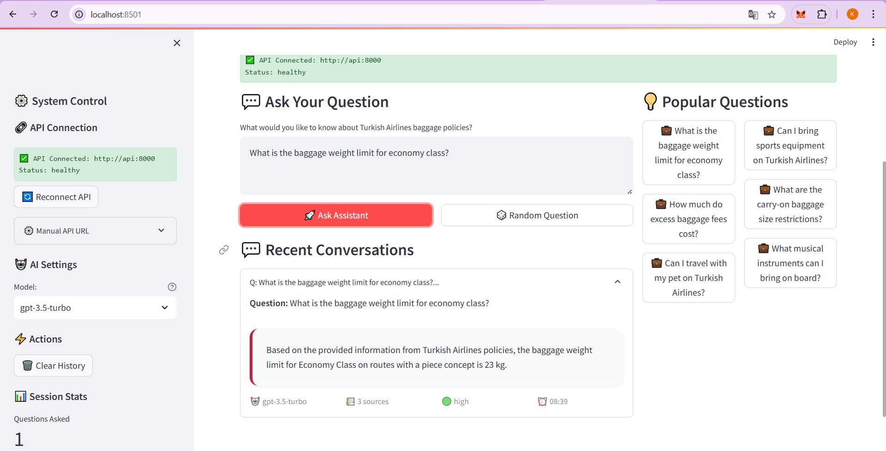

# 🇹🇷 Turkish Airlines Baggage Policy RAG Assistant

> **AI-Powered Customer Service System for Turkish Airlines Baggage Policies**

## Frontend Interface



The intuitive chat interface allows customers to ask questions in natural language and receive instant, accurate responses about Turkish Airlines baggage policies.

## Problem & Solution

**Problem:** Customers struggle to find accurate baggage policy information in complex documentation.

**Solution:** RAG-powered AI assistant that provides instant, accurate answers based on official Turkish Airlines policies.

**Business Value:**
- Reduces customer service workload
- Improves customer satisfaction with instant responses
- Ensures consistent, accurate policy information
- Scales automatically without human intervention

## Technology Stack

| Component | Technology | Purpose |
|-----------|------------|---------|
| **Database** | PostgreSQL + pgvector | Vector storage & traditional queries |
| **AI/ML** | SentenceTransformers + OpenAI | Semantic search + response generation |
| **Backend** | FastAPI + asyncpg | High-performance async API |
| **Frontend** | Streamlit | Customer chat interface |
| **Deployment** | Docker Compose | Microservices orchestration |
| **Data Processing** | BeautifulSoup | Web scraping & content extraction |

## System Architecture

```
Web Scraper → PostgreSQL+pgvector → FastAPI → Streamlit
                      ↓
              Vector Embeddings → OpenAI RAG → Customer Answers
```

## Installation

### Prerequisites
- Docker & Docker Compose
- OpenAI API Key ([Get here](https://platform.openai.com/api-keys))

### Setup

1. **Clone & Configure**
```bash
git clone <repository-url>
cd turkish-airlines-rag-assistant
```

2. **Environment Configuration**
```bash
# Create .env file
cat > .env << EOF
DB_HOST=db
DB_DATABASE=global_gate
DB_USER=postgres
DB_PASSWORD=secure_password_here
OPENAI_API_KEY=sk-your-openai-api-key-here
EOF
```

3. **Deploy**
```bash
cd docker

# Start all services
docker-compose up -d

# Verify deployment
docker-compose ps
```

4. **Access**
- **Customer Interface:** http://localhost:8501
- **API Documentation:** http://localhost:8000/docs
- **Health Check:** http://localhost:8000/health

### Service Startup Order
1. **Database** starts first (PostgreSQL + pgvector)
2. **Scraper** runs once to collect policy data
3. **API** provides endpoints and RAG functionality
4. **Frontend** serves customer interface

## Verification

```bash
# Check system health
curl http://localhost:8000/health

# Test search functionality
curl "http://localhost:8000/search?q=baggage+weight"

# Test RAG chat
curl -X POST "http://localhost:8000/chat/openai?question=What+is+the+baggage+weight+limit"
```

## Key Features

- **Semantic Search:** Finds relevant policies even with different wording
- **RAG Responses:** Generates accurate answers based on official documentation
- **Real-time Chat:** Instant customer support interface
- **Auto-scaling:** Handles multiple concurrent users
- **Quality Assurance:** Content scoring and duplicate detection
