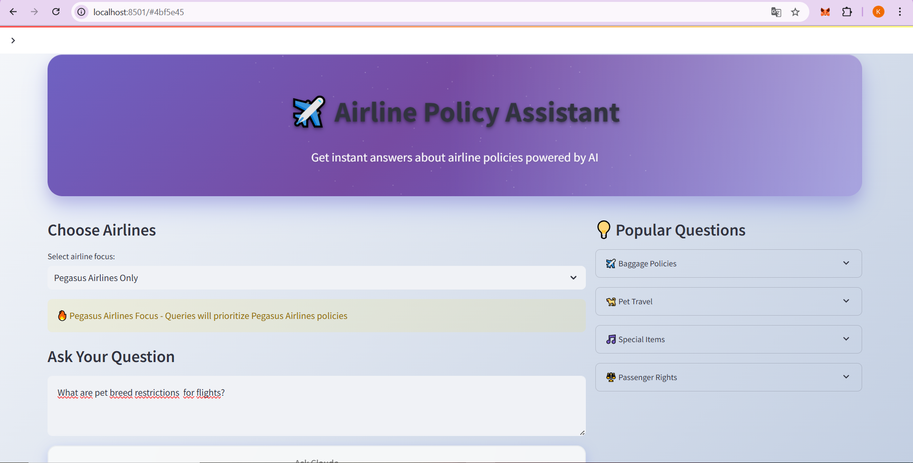
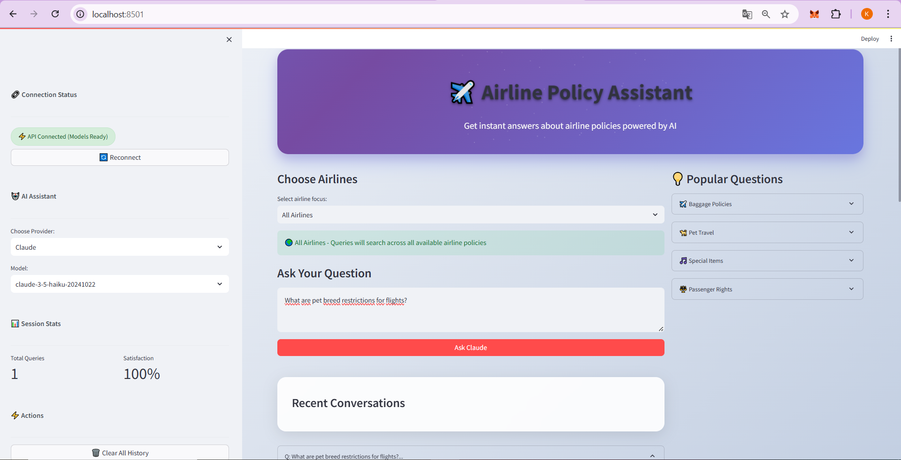
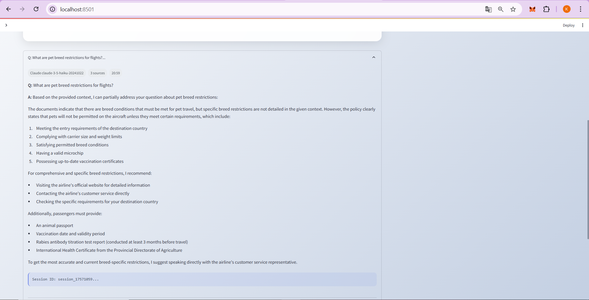
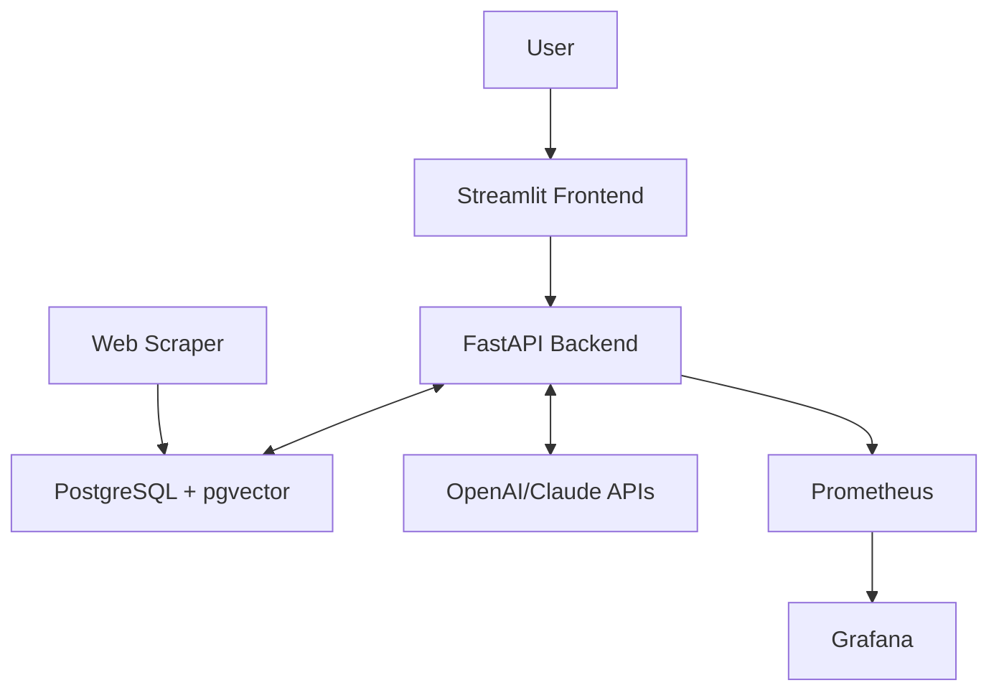

# AI-Powered Multi-Airline Policy Assistant

## Problem Statement & Solution

**Problem**: Travelers waste significant time navigating complex airline websites to find specific policy information, often encountering inconsistent or outdated data across multiple airline platforms.

**Solution**: Our AI-powered assistant eliminates the confusion by providing instant, accurate answers to airline policy questions through natural language queries. The system automatically scrapes and maintains up-to-date policy data from multiple airlines, then uses advanced semantic search to deliver precise, contextual responses.

### **A Quick Tour of the Application**

This intelligent RAG (Retrieval-Augmented Generation) system streamlines the process of finding airline policy information. Here's a quick look at the user experience from start to finish.

**1. The Main Interface:** Simply select an airline and type your question in natural language.

**2. The Backend in Action:** The system instantly connects to the API and processes your request.

**3. The Final Result:** Receive an instant, accurate, and sourced response to your query.

**4. Feedback:** Give your feedback. 

| The Main Interface | The Backend in Action |
|:------------------:|:---------------------:|
|  |  |
| **The Final Result** | **Feedback** |
|  |  |

*An intelligent RAG (Retrieval-Augmented Generation) system that provides instant, accurate answers to airline policy questions using natural language processing and real-time data from multiple airlines.*

## Technology Stack

| Technology | Purpose | Why Chosen |
|------------|---------|------------|
| **PostgreSQL + pgvector** | Database with Vector Storage | Reliable data persistence with efficient similarity search |
| **BeautifulSoup** | Web Scraping | Reliability, Ease of Use, Fault Tolerance|
| **Sentence Transformers (paraphrase-multilingual-MiniLM-L12-v2)** | Natural Language Processing | Open source semantic understanding for searching |
| **FastAPI** | Backend API Framework | High performance, automatic documentation, async support |
| **Docker Compose** | Container Orchestration | Simplified deployment, environment consistency |
| **Python** | Core Development Language | Rich ML/AI ecosystem, rapid development |
| **Streamlit** | Frontend Interface | Rapid prototyping, interactive data applications |
| **OpenAI API & Claude API** | LLM interaction | Response Generation for RAG applications |
| **Prometheus & Grafana**| Monitoring & Logging|Real-time performance tracking, industry-standard observability stack|

## System Architecture

The system follows a moduler architecture with orchestrated startup sequence:



## 📊 Service Endpoints
| Service | Port | URL |
|:--------|:----:|:----|
| **Frontend** | 8501 | http://localhost:8501 |
| **Backend API** | 8000 | http://localhost:8000 | 
| **Grafana** | 3000 | http://localhost:3000 | 
| **Prometheus** | 9090 | http://localhost:9090 | 
| **PostgreSQL** | 5432 | http://localhost:5432 |


## ✨ Key Features

- **🤖 RAG Pipeline**: Vector-based semantic search for precise information retrieval
- **🕷️ Real-time Scraping**: Automated airline data collection
- **🧠 Multi-LLM Support**: OpenAI GPT & Anthropic Claude integration
- **🔍 Multilingual Search**: Advanced semantic understanding
- **📊 Production Monitoring**: Prometheus & Grafana observability
- **🐳 Docker-Native**: Fully containerized microservices
- **⚡ High Performance**: Async FastAPI + PostgreSQL + pgvector
- **🚀 Intelligent Caching**: Multi-layered LRU cache with performance tracking and batch optimization
- **🧪 Comprehensive Testing**: Test coverage including unit, integration, and performance tests

## Installation & Setup

### Prerequisites
- Docker & Docker Compose
- OpenAI API Key
- Claude API Key

### Quick Start
```bash
# 1. Clone repository
git clone <repository-url>
cd multi-airline-rag-system

# 2. Set environment variables
cp .env.example .env
# Edit .env file with your OpenAI API key

# 3. Start all services
docker-compose up -d

# 4. Load initial data (one-time setup)
docker-compose run scraper python scraper_only.py
```

### Health Check
```bash
# Verify all services are running
curl http://localhost:8000/health
curl http://localhost:8501/_stcore/health
```

## Contributing

1. Fork the repository
2. Create a feature branch: `git checkout -b feature-name`
3. Commit changes: `git commit -m 'Add feature'`
4. Push to branch: `git push origin feature-name`
5. Submit a Pull Request

### Adding New Airlines
1. Implement scraper in `scrapers/` directory
2. Update database schema if needed
3. Add airline configuration to settings
4. Test data collection and search functionality

## Project Summary

This AI-powered airline policy assistant represents a modern approach to information retrieval in the travel industry. By combining web scraping, vector databases, and large language models, we've created a system that transforms how travelers access airline policy information. The solution addresses real pain points in travel planning while demonstrating practical applications of RAG architecture in production environments.

## Conclusion

Built with modern AI and microservices principles, this system showcases how intelligent automation can significantly improve user experience in complex information domains. The project serves both as a practical travel tool and a reference implementation for RAG-based information systems.

---

**Ready to streamline your travel planning? Start asking questions and experience the future of airline policy assistance.**
