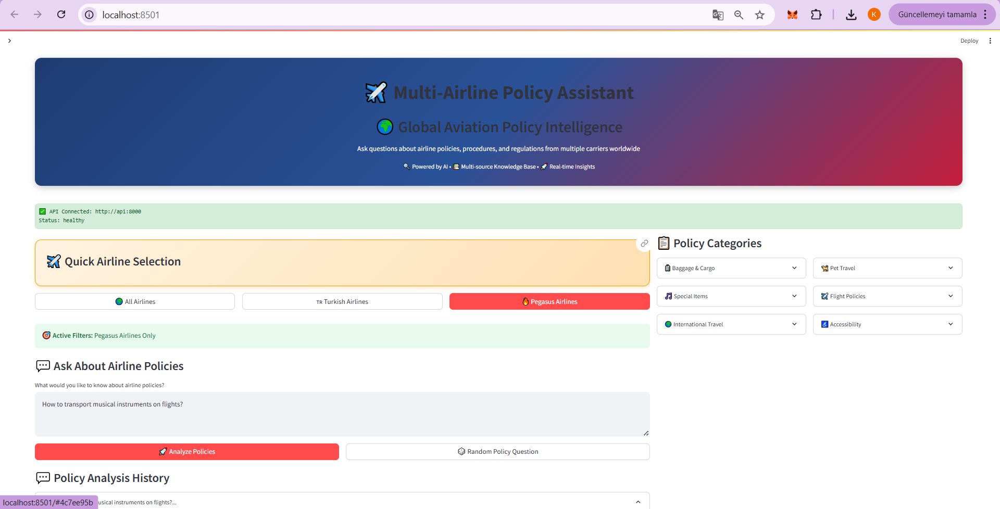
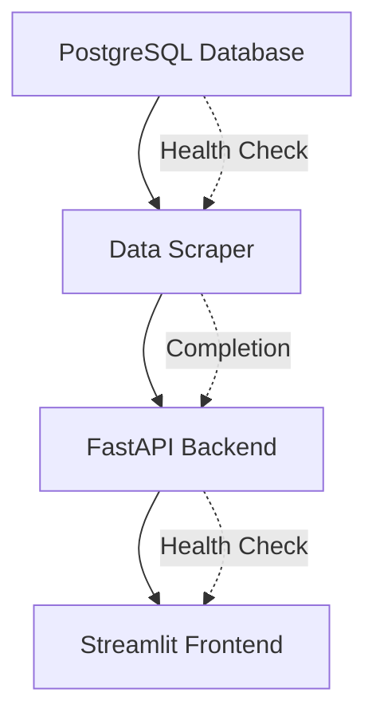

# AI-Powered Multi-Airline Policy Assistant



*An intelligent RAG (Retrieval-Augmented Generation) system that provides instant, accurate answers to airline policy questions using natural language processing and real-time data from multiple airlines.*

## Problem Statement & Solution

**Problem**: Travelers waste significant time navigating complex airline websites to find specific policy information, often encountering inconsistent or outdated data across multiple airline platforms.

**Solution**: Our AI-powered assistant eliminates the confusion by providing instant, accurate answers to airline policy questions through natural language queries. The system automatically scrapes and maintains up-to-date policy data from multiple airlines, then uses advanced semantic search to deliver precise, contextual responses.

## Technology Stack

| Technology | Purpose | Why Chosen |
|------------|---------|------------|
| **PostgreSQL + pgvector** | Database with Vector Storage | Reliable data persistence with efficient similarity search |
| **BeautifulSoup** | Web Scraping | Reliability, Ease of Use, Fault Tolerance|
| **Sentence Transformers (paraphrase-multilingual-MiniLM-L12-v2)** | Natural Language Processing | Open source semantic understanding and search |
| **FastAPI** | Backend API Framework | High performance, automatic documentation, async support |
| **Docker Compose** | Container Orchestration | Simplified deployment, environment consistency |
| **Python** | Core Development Language | Rich ML/AI ecosystem, rapid development |
| **Streamlit** | Frontend Interface | Rapid prototyping, interactive data applications |

## System Architecture

The system follows a moduler architecture with orchestrated startup sequence:



**Startup Sequence (Docker Compose)**:
1. **Database Service** - Initializes PostgreSQL with pgvector extension
2. **Scraper Service** - Collects airline policy data, then terminates
3. **API Service** - Loads ML models and serves endpoints
4. **Frontend Service** - Provides user interface

**Data Flow**:
```
User Query → Embedding Generation → Vector Search → Context Retrieval → AI Response
```

## Key Advantages

- **Time Efficiency**: Reduces policy research time from 30+ minutes to seconds
- **Accuracy**: Real-time data ensures up-to-date policy information
- **Natural Interface**: Ask questions in plain language, get human-like responses
- **Multi-Airline Support**: Unified access to policies from multiple airlines
- **Bilingual Support**: Handles both English and Turkish queries
- **Scalability**: Microservices architecture allows easy expansion
- **Cost-Effective**: Automated data collection reduces manual maintenance

## Installation & Setup

### Prerequisites
- Docker & Docker Compose
- OpenAI API Key
- Claude API Key

### Quick Start
```bash
# 1. Clone repository
git clone <repository-url>
cd multi-airline-rag-system

# 2. Set environment variables
cp .env.example .env
# Edit .env file with your OpenAI API key

# 3. Start all services
docker-compose up -d

# 4. Load initial data (one-time setup)
docker-compose run scraper python scraper_only.py

# 5. Access the application
# Web Interface: http://localhost:8501
# API Documentation: http://localhost:8000/docs
```

### Health Check
```bash
# Verify all services are running
curl http://localhost:8000/health
curl http://localhost:8501/_stcore/health
```

## Usage & API Reference

### Web Interface
Navigate to `http://localhost:8501` and ask questions like:
- "What's the baggage allowance for international flights?"
- "Can I bring my pet in the cabin?"
- "Compare carry-on policies between airlines"

### API Endpoints
```bash
# Semantic search
curl "http://localhost:8000/search?q=pet+travel+policy"

# AI-powered chat
curl -X POST "http://localhost:8000/chat/openai" \
  -H "Content-Type: application/json" \
  -d '{"question": "What items are prohibited in carry-on?"}'
```

## Contributing

1. Fork the repository
2. Create a feature branch: `git checkout -b feature-name`
3. Commit changes: `git commit -m 'Add feature'`
4. Push to branch: `git push origin feature-name`
5. Submit a Pull Request

### Adding New Airlines
1. Implement scraper in `scrapers/` directory
2. Update database schema if needed
3. Add airline configuration to settings
4. Test data collection and search functionality

## Project Summary

This AI-powered airline policy assistant represents a modern approach to information retrieval in the travel industry. By combining web scraping, vector databases, and large language models, we've created a system that transforms how travelers access airline policy information. The solution addresses real pain points in travel planning while demonstrating practical applications of RAG architecture in production environments.

## Conclusion

Built with modern AI and microservices principles, this system showcases how intelligent automation can significantly improve user experience in complex information domains. The project serves both as a practical travel tool and a reference implementation for RAG-based information systems.

---

**Ready to streamline your travel planning? Start asking questions and experience the future of airline policy assistance.**
