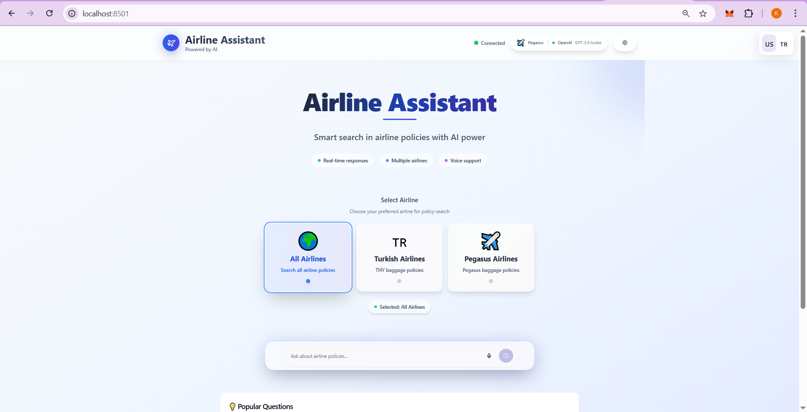
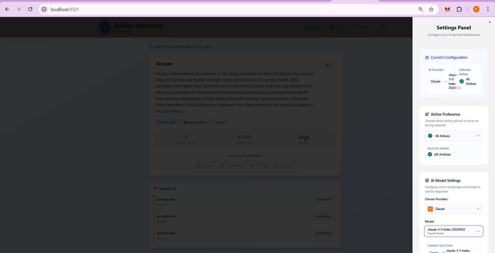
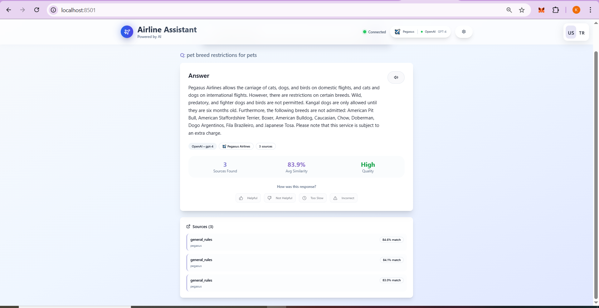
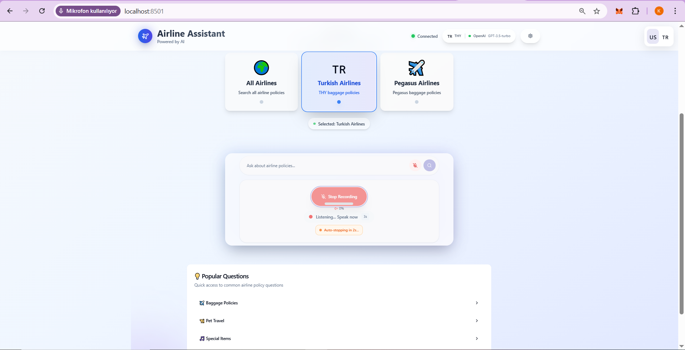
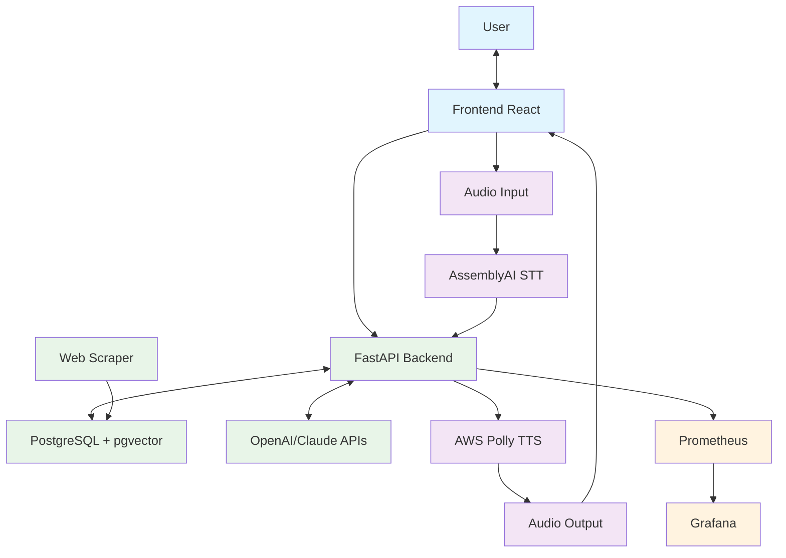

# AI-Powered Multi-Airline Policy Assistant

## Problem & Solution

**Problem**: Travelers waste significant time navigating complex airline websites to find specific policy information, often encountering inconsistent or outdated data across multiple airline platforms.

**Solution**: Our AI-powered assistant eliminates the confusion by providing instant, accurate answers to airline policy questions through natural language queries. The system automatically scrapes and maintains up-to-date policy data from multiple airlines, then uses advanced semantic search to deliver precise, contextual responses with multilingual support including voice interaction capabilities.

### **A Quick Tour of the Application**

This intelligent RAG (Retrieval-Augmented Generation) system streamlines the process of finding airline policy information. Here's a quick look at the user experience from start to finish.

**1. The Main Interface:** Simply select an airline and type your question in natural language or use voice input.

**2. The Backend in Action:** The system instantly connects to the API and processes your request with optional text-to-speech output.

**3. The Final Result:** Receive an instant, accurate, and sourced response to your query.

**4. Speaker System:** Ask your question via recording. 

| The Main Interface | The Backend in Action |
|:------------------:|:---------------------:|
|  |  |
| **The Final Result** | **Speaker System** |
|  |  |

*An intelligent RAG (Retrieval-Augmented Generation) system that provides instant, accurate answers to airline policy questions using natural language processing, real-time data from multiple airlines, and advanced speech capabilities.*

## Technology Stack

| Technology | Purpose | Why Chosen |
|------------|---------|------------|
| **PostgreSQL + pgvector** | Database with Vector Storage | Reliable data persistence with efficient similarity search |
| **BeautifulSoup** | Web Scraping | Reliability, Ease of Use, Fault Tolerance|
| **Sentence Transformers (gte-multilingual-base)** | Natural Language Processing | Open source semantic understanding for searching |
| **FastAPI** | Backend API Framework | High performance, automatic documentation, async support |
| **Docker Compose** | Container Orchestration | Simplified deployment, environment consistency |
| **Python** | Core Development Language | Rich ML/AI ecosystem, rapid development |
| **React + TypeScript** | Frontend Interface | Modern UI framework with type safety, excellent user experience |
| **Vite**| Frontend Build Tool | Fast development server, optimized production builds |
| **Tailwind CSS**| Styling Framework | Rapid UI development, consistent design system |
| **OpenAI API & Claude API** | LLM interaction | Response Generation for RAG applications |
| **AWS Polly** | Text-to-Speech (TTS) | High-quality voice synthesis with multilingual support |
| **AssemblyAI**| Speech-to-Text (STT) | Real-time transcription with high accuracy and language detection |
| **Prometheus & Grafana**| Monitoring & Logging|Real-time performance tracking, industry-standard observability stack|

## System Architecture

The system follows a moduler architecture with orchestrated startup sequence:



## 📊 Service Endpoints
| Service | Port | URL |
|:--------|:----:|:----|
| **Frontend React** | 8501 | http://localhost:8501 |
| **Backend API** | 8000 | http://localhost:8000 | 
| **Grafana** | 3000 | http://localhost:3000 | 
| **Prometheus** | 9090 | http://localhost:9090 | 
| **PostgreSQL** | 5432 | http://localhost:5432 |

## ✨ Key Features

- **🤖 RAG Pipeline**: Vector-based semantic search for precise information retrieval
- **🕷️ Real-time Scraping**: Automated airline data collection
- **🧠 Multi-LLM Support**: OpenAI GPT & Anthropic Claude integration
- **🔍 Multilingual Search**: Advanced semantic understanding
- **🎤 Speech-to-Text**: Real-time voice input with AssemblyAI
- **🔊 Text-to-Speech**: High-quality voice output with AWS Polly
- **🌍 Voice Multilingual**: Turkish and English language voice support
- **📊 Production Monitoring**: Prometheus & Grafana observability
- **🐳 Docker-Native**: Fully containerized microservices
- **⚡ High Performance**: Async FastAPI + PostgreSQL + pgvector
- **🚀 Intelligent Caching**: Multi-layered LRU cache with performance tracking and batch optimization
- **📱 Responsive Design: Modern UI that works on desktop and mobile**:  Modern UI that works on desktop and mobile
- **♿ Accessibility**: Screen reader support, keyboard navigation, voice features 
- **🧪 Comprehensive Testing**: Test coverage including unit, integration, and performance tests
- **🔐 Secure Secrets Management**: Docker Secrets integration for safe API key storage and rotation

## Installation & Setup

### Prerequisites
- Docker & Docker Compose
- OpenAI API Key
- Anthropic Claude API Key
- AWS Credentials (for TTS)
- AssemblyAI API Key (for STT)

### Quick Start
```bash
# 1. Clone repository
git clone <repository-url>
cd multi-airline-rag-system

# 2. Set environment variables
cp .env.example .env
# Edit .env file with your OpenAI API key

# 3. Start all services
docker-compose up -d

# 4. Load initial data (one-time setup)
docker-compose run scraper python scraper_only.py
```

### Health Check
```bash
# Verify all services are running
curl http://localhost:8000/health
curl http://localhost:8501/_stcore/health

# Check speech services specifically
curl http://localhost:8000/speech/health
curl http://localhost:8000/speech/assemblyai/info
```

### Performance Metrics
The system tracks comprehensive metrics including:
- Speech Processing Time: STT/TTS latency monitoring
- API Response Times: End-to-end request tracking
- Accuracy Metrics: Transcription and response quality
- Cost Tracking: API usage and billing optimization

Access metrics and graphs at: http://localhost:3000 (Grafana Dashboard)

## Project Summary

This AI-powered airline policy assistant represents a modern approach to information retrieval in the travel industry. By combining web scraping, vector databases, large language models, and advanced speech processing capabilities, we've created a comprehensive system that transforms how travelers access airline policy information. The solution addresses real pain points in travel planning while demonstrating practical applications of RAG architecture with multimodal interaction in production environments.

---
**Ready to streamline your travel planning? Start asking questions through text or voice and experience the future of airline policy assistance with full speech integration.**
