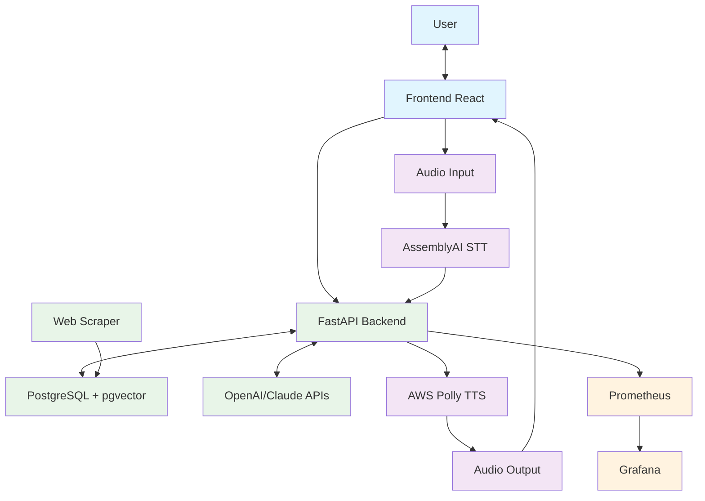

# AI-Powered Multi-Airline Policy Assistant


## Problem

Airline policy information is scattered, inconsistent, and hard to access when you actually need it. [Phone support averages 2-12 hours](https://www.mightytravels.com/2024/10/how-major-airlines-customer-service-response-times-compare-analysis-of-7-leading-carriers-in-2024/). [80% of travelers](https://www.cxtoday.com/speech-analytics/chatbots-are-still-frustrating-customers-here-is-why/) say standard chatbots can't answer simple policy questions. And when you're rushing between gates or driving to the airport, typing through FAQ pages isn't practical.

## Solution

A voice-enabled assistant that understands natural language and compares policies across multiple airlines. Semantic search interprets intent—not just keywords. Response time under 3 seconds. Voice support in Turkish and English for hands-free use.

| Interface | Result |
|:---------:|:------:|
|  |  |
|  |  |

## System Architecture

Speech services run as separate streams—TTS failure doesn't block query processing. Dual-LLM setup enables quality comparison and prevents vendor lock-in.



## Technology Decisions

| Technology | Purpose | Trade-off Reasoning |
|------------|---------|---------------------|
| **pgvector** | Vector Search | Reduced overhead vs Pinecone/Weaviate. Sufficient for policy-scale datasets. |
| **gte-multilingual-base** | Embeddings | Open-source, no per-query cost. Native Turkish/English support. |
| **FastAPI** | Backend | Async handles concurrent LLM + STT + TTS calls. |
| **BeautifulSoup** | Scraping | Sufficient for general-purpose scraping needs. |
| **OpenAI + Claude** | LLM | Dual-provider prevents lock-in. Enables quality comparison. |
| **AssemblyAI** | STT | Strong Turkish accuracy. Handles background noise well. |

## Core Capabilities

**RAG Pipeline**: Semantic search with source attribution. Reduces hallucination risk.

**Voice Interface**: Real-time STT/TTS in Turkish and English.

**Production Monitoring**: Prometheus + Grafana for latency, errors, and API costs.

**Multi-LLM Support**: Switch providers without code changes.

**Intelligent Caching**: Multi-layer LRU cache for repeated queries.

## Quick Start

```bash
git clone <repository-url>
cd multi-airline-rag-system
cp .env.example .env

docker-compose up -d
docker-compose run scraper python scraper_only.py

curl http://localhost:8000/health
```

| Service | URL |
|---------|-----|
| Frontend | http://localhost:8501 |
| API | http://localhost:8000 |
| Grafana | http://localhost:3000 |
