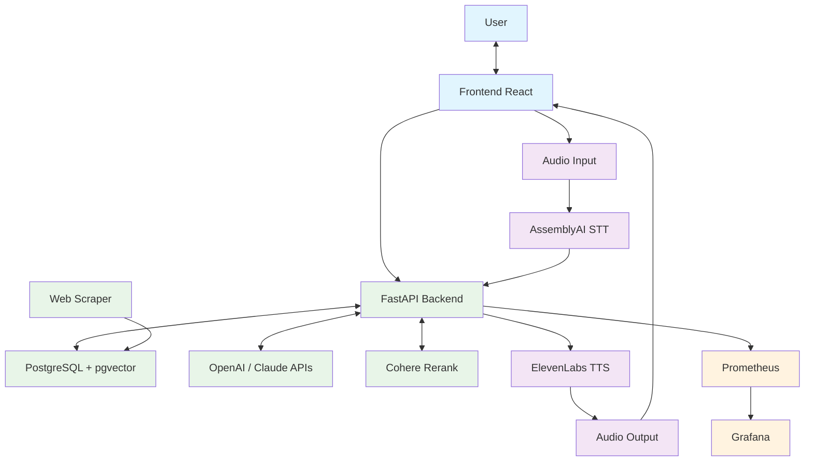

# AI-Powered Multi-Airline Policy Assistant


<p align="center">
  
</p>

## Problem

Airline policy information is scattered, inconsistent, and hard to access when you actually need it. [Phone support averages 2-12 hours](https://www.mightytravels.com/2024/10/how-major-airlines-customer-service-response-times-compare-analysis-of-7-leading-carriers-in-2024/). [80% of travelers](https://www.cxtoday.com/speech-analytics/chatbots-are-still-frustrating-customers-here-is-why/) say standard chatbots can't answer simple policy questions. And when you're rushing between gates or driving to the airport, typing through FAQ pages isn't practical.

## Solution

A voice-enabled assistant that understands natural language and compares policies across multiple airlines. Semantic search interprets intent—not just keywords. Response time under 3 seconds. Voice support in Turkish and English for hands-free use.

## Demo Video

https://github.com/user-attachments/assets/0366c7bf-c611-4f1b-9775-27c297a8ab25

## Screenshots

<p align="center">
  
  <br/>
  <em>Answer with source attribution, similarity scores, and quality metadata.</em>
</p>

<p align="center">
  
  <br/>
  <em>Settings — switch between airlines, LLM providers, and models.</em>
</p>

## System Architecture

Speech services run as separate streams—TTS failure doesn't block query processing. Dual-LLM setup enables quality comparison and prevents vendor lock-in.


```mermaid
graph TD
    A[User] <--> B[Frontend React]
    B --> C[FastAPI Backend]

    B --> I[Audio Input]
    I --> J[AssemblyAI STT]
    J --> C

    C <--> D[PostgreSQL + pgvector]
    E[Web Scraper] --> D
    C <--> F[OpenAI / Claude APIs]
    C <--> M[Cohere Rerank]

    C --> K[ElevenLabs TTS]
    K --> L[Audio Output]
    L --> B

    G[Prometheus] --> H[Grafana]
    C --> G

    classDef userPath fill:#e1f5fe
    classDef audioPath fill:#f3e5f5
    classDef backend fill:#e8f5e8
    classDef monitoring fill:#fff3e0

    class A,B userPath
    class I,J,K,L audioPath
    class C,D,E,F,M backend
    class G,H monitoring
```

## Technology Decisions

| Technology | Purpose | Trade-off Reasoning |
|------------|---------|---------------------|
| **pgvector** | Vector Search | Reduced overhead vs Pinecone/Weaviate. Sufficient for policy-scale datasets. |
| **gte-multilingual-base** | Embeddings | Open-source, no per-query cost. Native Turkish/English support. |
| **Cohere rerank-v3.5** | Cross-encoder reranking | Multilingual (100+ languages), strong Turkish quality, stable API. Improves top-5 precision over pure vector search. |
| **FastAPI** | Backend | Async handles concurrent LLM + STT + TTS calls. |
| **React + Vite** | Frontend | Fast dev loop, typed components, native voice API support. |
| **BeautifulSoup** | Scraping | Sufficient for general-purpose scraping needs. |
| **OpenAI + Claude** | LLM | Dual-provider prevents lock-in. Enables quality comparison. |
| **AssemblyAI** | STT | Strong Turkish accuracy. Handles background noise well. |
| **ElevenLabs (turbo_v2_5)** | TTS | Low-latency multilingual output. Better Turkish prosody than open alternatives. |

For deeper rationale on each decision, see [ARCHITECTURE.md](ARCHITECTURE.md).

## Core Capabilities

**RAG Pipeline**: Semantic search → Cohere rerank → LLM answer generation, with source attribution. Reduces hallucination risk.

**Voice Interface**: Real-time STT/TTS in Turkish and English.

**Production Monitoring**: Prometheus + Grafana for latency, errors, and API costs. Sentry for frontend/backend error tracking.

**Multi-LLM Support**: Switch providers without code changes.

**Intelligent Caching**: Multi-layer LRU cache for repeated queries.

**Metadata-Aware Routing**: Airline-level metadata prefiltering combined with query routing to the correct policy domain.

**Graceful Degradation**: If the reranker or TTS are unavailable, the system continues in a reduced-quality mode rather than failing outright.

## Quick Start

### 1. Clone and Setup
```bash
git clone <repository-url>
cd global_gate
```

### 2. Configure Secrets

This project uses Docker Secrets (file-based). Create the `secrets/` directory and add one file per credential:

```bash
mkdir -p secrets
echo "your_postgres_password" > secrets/postgres_password
echo "your_openai_api_key"    > secrets/openai_api_key
echo "your_anthropic_api_key" > secrets/anthropic_api_key
echo "your_assemblyai_api_key" > secrets/assemblyai_api_key
echo "your_elevenlabs_api_key" > secrets/elevenlabs_api_key
chmod 600 secrets/*
```

> The `secrets/` directory is gitignored. For local-only scripts that need a database URL (e.g. under `scripts/`), set `DATABASE_URL` in a local `.env` file.

### 3. Start the Application
```bash
docker-compose up -d
```

> **Note:** Initial startup may take **3-5 minutes** as Docker builds the images and downloads ML models.

### 4. Run the Scraper
```bash
docker-compose run scraper python scraper_only.py
```

### 5. Verify Installation
```bash
curl http://localhost:8000/health
```

| Service | URL |
|---------|-----|
| Frontend | http://localhost:8501 |
| API | http://localhost:8000 |
| API Docs | http://localhost:8000/docs |
| Grafana | http://localhost:3000 |

## Production Deployment

A separate `docker-compose-prod.yml` is provided for platforms that inject secrets as environment variables (Railway, Render, Fly.io). The production compose omits the scraper and local monitoring stack.

---

Feedback and collaboration are welcome. Contact: kadirqokdeniz@hotmail.com